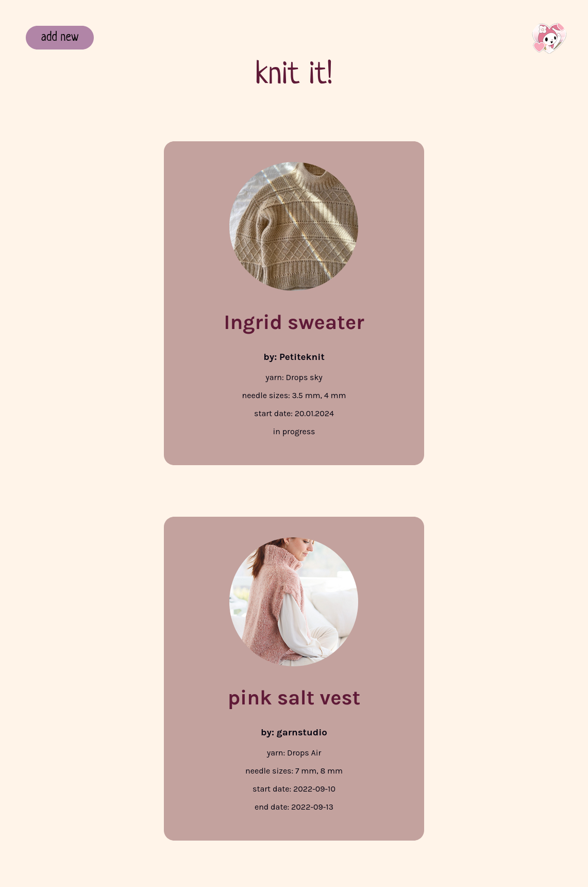
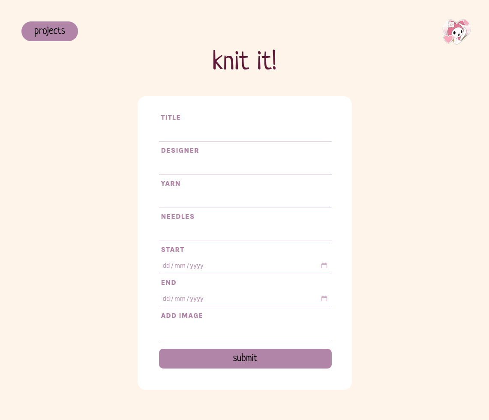

# knit it!

## Introduction

*knit it!* is a website desgined to store all of your ongoing knitting projects. This project has been made with React JS and MySQL frameworks

## Installation

### Start expresss server

1. In the terminal run:

```
npm start
```

Don't kill it; let it run.

### Start frontend dev server

2. In a fresh, second terminal run:

```
cd client
npm run dev
```

Don't kill it; let it run.

### Run mysql

3. In a third terminal run:

```
mysql -u root -p
<enter your mysql password>
USE knitit;
```

Or if you already have set up mysql so you skip entering password:

```
mysql
USE knitit;
```

Now you are free to run your queries, such as:

```
SHOW tables;
SELECT * FROM <tablename>;
DESC <tablename>;
```


## Front end

### Projects page

This page stores the projects that have been inputted. The project card will display an image and title together with information. If an end date has not been added to the project, "in progress" will be visible instead of the date.



### New project form

This page displays a simple form for inputting necessary data. End date input is optional.



## Back end

### Database

The database for *knit it!* has been made using MySQL. The apps used for working on the backend are [Beekeeper Studio](https://www.beekeeperstudio.io/) and [Insomnia](https://insomnia.rest/)


## To be added:

- edit projects
- instead of image urls, drop your own files
- create log in feature
- inspiration page using an external api
- add row counters for each project documented

  *this project was made by the guidance of the CodeOp bootcamp.*
